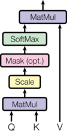
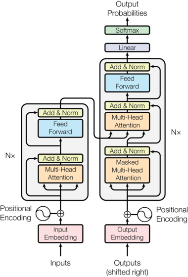
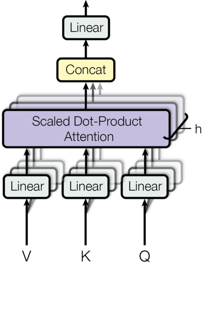

# Attention Is All You Need Paper

Detailed walkthrough of the Transformer architecture from Vaswani et al. (2017). The focus is on building solid intuition for Q/K/V attention and how all the pieces compose into the full model.

---

## Q/K/V Attention as Soft Dictionary Lookup

The core problem: given a sequence of tokens, each token needs to gather information from other tokens to build a context-aware representation. Attention provides the mechanism for deciding how much token $i$ should attend to token $j$.

The clearest mental model is a **soft key-value store**:

| Concept | Hard lookup (Python dict) | Soft lookup (attention) |
|---|---|---|
| **Query** | The search term | Learned projection: "what am I looking for?" |
| **Key** | The index/label of each entry | Learned projection: "what do I contain?" |
| **Value** | The data stored at each entry | Learned projection: "what should I return?" |
| **Match** | Exact equality → one result | Dot-product similarity → weighted sum of all results |

A dict does `result = store[query]`. Attention does `result = weighted_sum(all_values, weights=softmax(similarity(query, all_keys)))`.

---

## From Embeddings to Q, K, V

Starting point: a sequence of $n$ token embeddings, each of dimension $d_{\text{model}}$:

$$X \in \mathbb{R}^{n \times d_{\text{model}}}$$

Three **learned** linear projections produce Q, K, V:

$$Q = XW^Q, \quad K = XW^K, \quad V = XW^V$$

$$W^Q, W^K \in \mathbb{R}^{d_{\text{model}} \times d_k}, \quad W^V \in \mathbb{R}^{d_{\text{model}} \times d_v}$$

The reason for three separate projections (rather than reusing $X$ directly) is that each token plays three distinct roles simultaneously:

- As a **query**: "I'm the word *cat*, I'm looking for adjectives that modify me"
- As a **key**: "I'm the word *black*, I'm an adjective that modifies nouns"
- As a **value**: "If you attend to me, here's the semantic content I contribute"

Using $X$ for all three would force every token to represent all three roles in the same vector. Separate projections give the model **different subspaces** for "what I'm looking for" vs "what I advertise" vs "what I deliver."

---

## The Attention Computation

$$\text{Attention}(Q, K, V) = \text{softmax}\!\left(\frac{QK^T}{\sqrt{d_k}}\right) V$$

Walking through this for a single query vector $q_i$ (row $i$ of $Q$):

### Step 1: Score every key against this query

$$s_{ij} = q_i \cdot k_j = \sum_{l=1}^{d_k} q_{il} \, k_{jl}$$

A dot product. High value means token $j$'s key matches what token $i$'s query is looking for. The result is a vector of $n$ scores.

### Step 2: Scale by $\sqrt{d_k}$

$$s_{ij} \leftarrow \frac{s_{ij}}{\sqrt{d_k}}$$

Without scaling, when $d_k$ is large the dot products grow in magnitude. Specifically, if entries of $q$ and $k$ are i.i.d. with zero mean and unit variance:

$$\text{Var}(q \cdot k) = \text{Var}\!\left(\sum_{l=1}^{d_k} q_l k_l\right) = \sum_{l=1}^{d_k} \text{Var}(q_l k_l) = d_k$$

So standard deviation grows as $\sqrt{d_k}$. For $d_k = 512$, that is std $\approx 22.6$, which pushes softmax into saturated regions where $\frac{\partial \text{softmax}}{\partial x} \approx 0$ and gradients vanish.

Dividing by $\sqrt{d_k}$ normalizes:

$$\text{Var}\!\left(\frac{q \cdot k}{\sqrt{d_k}}\right) = \frac{d_k}{d_k} = 1$$

### Step 3: Softmax to get attention weights

$$\alpha_{ij} = \frac{\exp(s_{ij})}{\sum_{l=1}^{n} \exp(s_{il})}$$

Now $\alpha_i$ is a probability distribution over all positions. Token $i$ pays attention to token $j$ in proportion to $\alpha_{ij}$.

### Step 4: Weighted sum of values

$$z_i = \sum_{j=1}^{n} \alpha_{ij} \, v_j$$

The output for token $i$ is a blend of all value vectors, weighted by how relevant each key was to this query.

---

## Numerical Walkthrough

Three tokens: `["The", "black", "cat"]`, with $d_k = 2$ for illustration.

After projection:

| Token | Q (looking for?) | K (advertising?) | V (delivering?) |
|---|---|---|---|
| The | $[0.1, 0.3]$ | $[0.2, 0.1]$ | $[1.0, 0.0]$ |
| black | $[0.4, 0.2]$ | $[0.5, 0.8]$ | $[0.0, 1.0]$ |
| cat | $[0.6, 0.7]$ | $[0.3, 0.4]$ | $[0.5, 0.5]$ |

Computing attention for **"cat"** as query, $q_{\text{cat}} = [0.6, 0.7]$:

**Scores against each key:**

$$q_{\text{cat}} \cdot k_{\text{The}} = 0.6(0.2) + 0.7(0.1) = 0.19$$

$$q_{\text{cat}} \cdot k_{\text{black}} = 0.6(0.5) + 0.7(0.8) = 0.86$$

$$q_{\text{cat}} \cdot k_{\text{cat}} = 0.6(0.3) + 0.7(0.4) = 0.46$$

**Scale by** $1/\sqrt{2} \approx 0.707$: scores become $[0.134, 0.608, 0.325]$

**Softmax:** $[0.269, 0.432, 0.299]$

**Output for "cat":**

$$0.269 \cdot [1,0] + 0.432 \cdot [0,1] + 0.299 \cdot [0.5, 0.5] = [0.419, 0.582]$$

"Cat" attended most strongly to "black" (weight 0.432), the adjective modifying it.

---

## Multi-Head Attention

A single attention head captures one "type" of relationship. Multi-head attention runs $h$ parallel attention computations, each with its own learned projections:

$$\text{head}_i = \text{Attention}(XW_i^Q, XW_i^K, XW_i^V)$$

Then concatenate and project back:

$$\text{MultiHead}(X) = \text{Concat}(\text{head}_1, \ldots, \text{head}_h) \, W^O$$

Each head operates in a subspace of dimension $d_k = d_v = d_{\text{model}} / h$, so total computation is equivalent to a single head at full dimensionality. The benefit: different heads can specialize in different attention patterns (syntactic dependencies, coreference, positional proximity, etc.).

**Dimensions:**

$$W_i^Q \in \mathbb{R}^{d_{\text{model}} \times d_k}, \quad W_i^K \in \mathbb{R}^{d_{\text{model}} \times d_k}, \quad W_i^V \in \mathbb{R}^{d_{\text{model}} \times d_v}, \quad W^O \in \mathbb{R}^{h \cdot d_v \times d_{\text{model}}}$$

---

## The Full Transformer Block





### Feedforward Network (FFN)

A 2-layer MLP applied independently to each position:

$$\text{FFN}(x) = \text{ReLU}(xW_1 + b_1)W_2 + b_2$$

$$W_1 \in \mathbb{R}^{d_{\text{model}} \times d_{ff}}, \quad W_2 \in \mathbb{R}^{d_{ff} \times d_{\text{model}}}$$

Typically $d_{ff} = 4 \times d_{\text{model}}$. The division of labor: attention handles **inter-token** mixing (information flow between positions), while the FFN handles **per-token** transformation (processing information within each position).

### Residual Connections + LayerNorm

Residual connections ($x + \text{sublayer}(x)$) prevent gradient degradation through deep stacks. LayerNorm stabilizes activations:

$$\text{LayerNorm}(x) = \gamma \odot \frac{x - \mu}{\sqrt{\sigma^2 + \epsilon}} + \beta$$

where for a single token's feature vector $x \in \mathbb{R}^{d}$:

$$\mu = \frac{1}{d}\sum_{i=1}^{d} x_i, \quad \sigma^2 = \frac{1}{d}\sum_{i=1}^{d} (x_i - \mu)^2$$

- $\gamma, \beta \in \mathbb{R}^{d}$: learned scale and shift parameters (per feature dimension)
- $\epsilon$: small constant (e.g. $10^{-6}$) for numerical stability
- $\odot$: element-wise multiplication

$\mu$ and $\sigma^2$ are computed across the feature dimension for each token independently.

---

## Encoder vs Decoder

### Encoder

- Stack of $N$ identical blocks (as described above)
- **Bidirectional** self-attention: each token attends to all positions
- Suited for tasks where full context is available (classification, encoding for downstream use)

### Decoder

Two additions compared to the encoder:

**1. Masked self-attention (causal mask).** Position $i$ can only attend to positions $j \leq i$. This prevents looking at future tokens during autoregressive generation.

$$\text{mask}_{ij} = \begin{cases} 0 & \text{if } j \leq i \\ -\infty & \text{if } j > i \end{cases}$$

Applied before softmax: $\text{softmax}\!\left(\frac{QK^T}{\sqrt{d_k}} + \text{mask}\right) V$

The $-\infty$ entries become 0 after softmax, so future positions contribute nothing.

**2. Cross-attention.** An additional attention sublayer where:

- $Q$ comes from the decoder (current layer's representation)
- $K, V$ come from the encoder output

This lets each decoder position attend to all encoder positions. The decoder "reads" the encoded input through this mechanism.

### Full decoder block structure

```
Input (shifted outputs)
  |
  |---> Masked Self-Attention ---> + ---> LayerNorm
  |                                ^
  +--------------------------------+
  |
  |---> Cross-Attention(Q=decoder, K,V=encoder) ---> + ---> LayerNorm
  |                                                   ^
  +---------------------------------------------------+
  |
  |---> FFN ---> + ---> LayerNorm ---> Output
  |              ^
  +--------------+
```

---

## Positional Encoding

Self-attention is **permutation-equivariant**: swapping two tokens in the input swaps the corresponding outputs, but the attention weights are unchanged. Without position information, "the cat sat" and "sat cat the" produce identical attention patterns.

The original paper uses sinusoidal positional encodings added directly to the input embeddings:

$$PE_{(pos, 2i)} = \sin\!\left(\frac{pos}{10000^{2i/d_{\text{model}}}}\right)$$

$$PE_{(pos, 2i+1)} = \cos\!\left(\frac{pos}{10000^{2i/d_{\text{model}}}}\right)$$

Each dimension $i$ oscillates at a different frequency. The key property: for any fixed offset $k$, $PE_{pos+k}$ can be expressed as a linear function of $PE_{pos}$, which allows the model to learn relative positions from absolute encodings.

---

## Training Setup

### Output projection

For language modeling / translation, the decoder output is projected to vocabulary size:

$$P(\text{next token}) = \text{softmax}(z \, W_{\text{vocab}} + b)$$

### Loss function

Cross-entropy over the vocabulary at each position:

$$\mathcal{L} = -\sum_{t=1}^{T} \log P(y_t \mid y_{<t}, X)$$

where $y_t$ is the ground-truth token at position $t$.

### Label smoothing

Instead of hard one-hot targets, use $\epsilon_{\text{ls}} = 0.1$:

$$y_{\text{smooth}} = (1 - \epsilon) \cdot y_{\text{one-hot}} + \frac{\epsilon}{|\text{vocab}|}$$

This prevents overconfidence and improves generalization.

### Optimizer

Adam with $\beta_1 = 0.9$, $\beta_2 = 0.98$, $\epsilon = 10^{-9}$, with a warmup + decay schedule:

$$lr = d_{\text{model}}^{-0.5} \cdot \min(\text{step}^{-0.5}, \; \text{step} \cdot \text{warmup}^{-1.5})$$

Linear warmup for `warmup_steps`, then inverse-square-root decay.

---

## Base Model Dimensions

| Parameter | Value |
|---|---|
| $d_{\text{model}}$ | 512 |
| $h$ (heads) | 8 |
| $d_k = d_v = d_{\text{model}} / h$ | 64 |
| $d_{ff}$ | 2048 |
| $N$ (encoder/decoder layers) | 6 |
| Vocabulary | ~37K (BPE) |
| Total parameters | ~65M |

---

## Further Reading

1. **"Attention Is All You Need"** (Vaswani et al., 2017) : the original paper
2. **[The Annotated Transformer](https://nlp.seas.harvard.edu/annotated-transformer/)** (Harvard NLP) : line-by-line PyTorch implementation with commentary
3. **[The Illustrated Transformer](https://jalammar.github.io/illustrated-transformer/)** (Jay Alammar) : visual walkthroughs of attention, multi-head, and the full architecture
